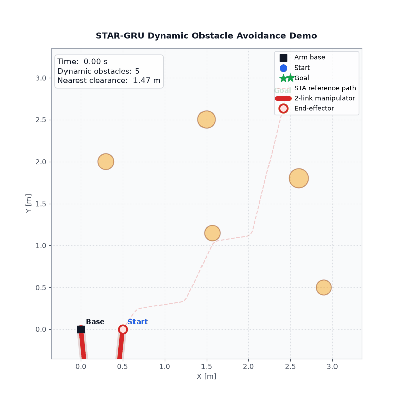
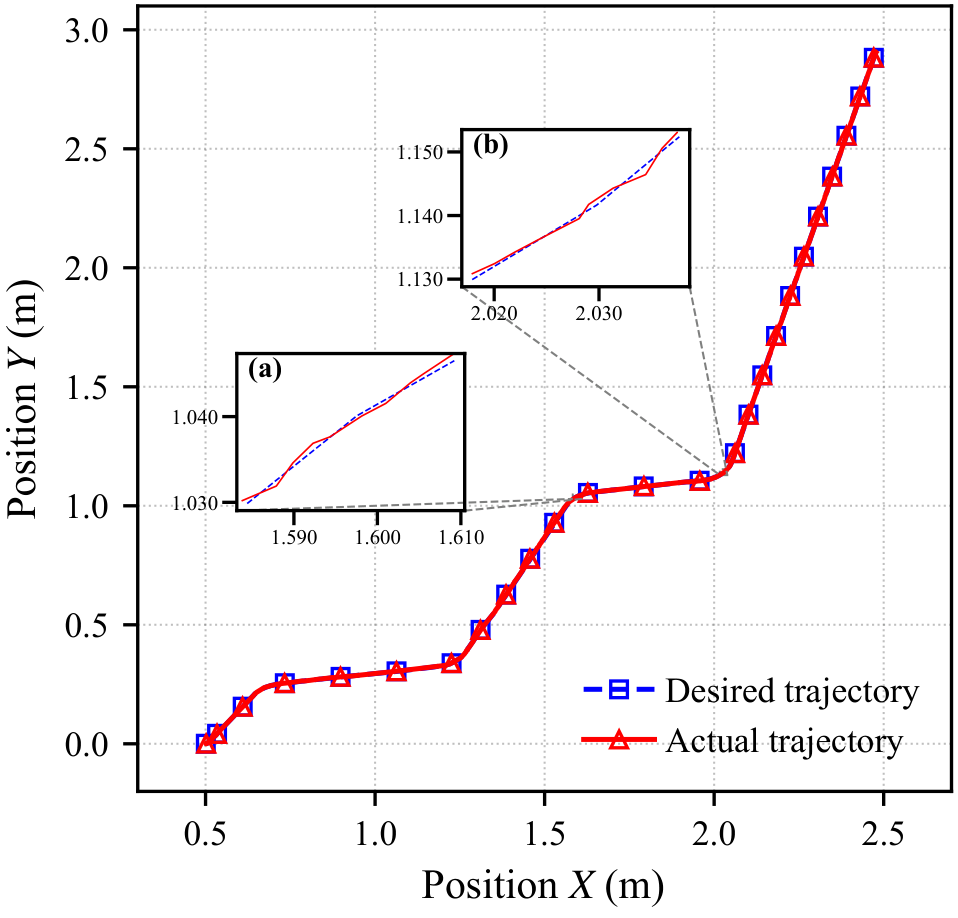

# flexible-manipulator-obstacle-avoidance

动态障碍环境下的机械臂轨迹规划与控制系统。融合时空注意力网络进行环境感知与风险预测，结合滚动时域决策实现实时避障，并通过动力学约束下的DRL完成轨迹跟踪与力矩控制。

`Python` `PyTorch` `Spatial Attention` `GRU` `Reinforcement Learning` `TCN` `Lagrangian Mechanics` `NumPy` `Matplotlib`

## 主要工作

1. **搭建动态障碍仿真环境**
   从零构建包含机器人、障碍物与工作空间的二维仿真平台，支持匀速、变加速、
   正弦曲线三种运动模式，可灵活配置障碍物数量与场景密度。完成仿真数据采集、
   轨迹记录与批量实验流程。

2. **实现STAR-GRU模型的训练与部署**
   独立完成数据预处理、网络搭建、训练与本地推理部署。模型以历史状态窗口
   为输入，同步输出未来轨迹与碰撞风险评分，推理延迟满足实时规划要求。

3. **跑通感知-规划-控制完整闭环**
   结合STAR-GRU风险评分与几何碰撞检测设计模式切换逻辑，实现全局引导
   与局部避障的实时切换。系统在复杂动态场景下稳定运行，完整覆盖从环境
   感知到末端轨迹输出的全链路。

4. **接入刚柔耦合动力学并完成DRL轨迹跟踪**
   将柔性机械臂Lagrangian动力学作为物理约束嵌入DRL策略评估，
   联合TCN-DNN策略网络完成从参考轨迹到关节力矩的在线求解，
   末端跟踪误差< 1 mm。

## Demo

**动态避障规划**



**轨迹跟踪**



## 项目结构

```text
main.py                      动态避障规划入口
environment.py               机器人、障碍物、工作空间
simulation.py                闭环仿真循环
controller.py                末端执行器速度控制器
visualization.py             Matplotlib可视化
decision/                    风险决策与规划调度
global_layer/                全局目标引导
local_layer/                 STAR-GRU局部避障推理
tracking/                    DRL轨迹跟踪与柔性机械臂动力学
    run_tracking.py          跟踪Demo入口
    drl_solver.py            动力学驱动在线优化求解
    tcn.py / dnn.py          策略网络
    forward_kinematics.py    正运动学
    dynamics/                柔性机械臂动力学模型
assets/                      Demo图片与GIF
```

## 论文

本仓库对应已投稿论文的主体方法实现，展示核心算法与系统架构。模型权重及涉密数据未包含在内。

